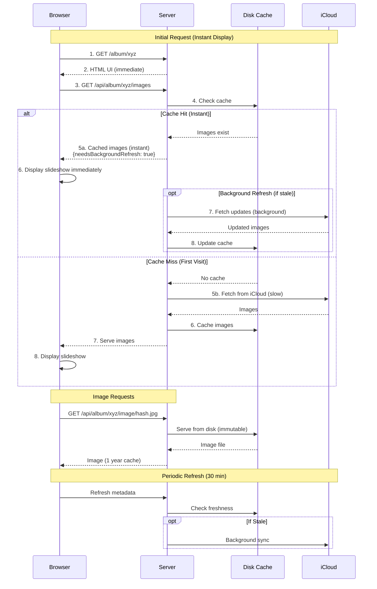

# Pildiraam - iCloud Shared Album Digital Photo Frame

## Project Overview
Build a TypeScript Node.js web service that creates a digital photo frame slideshow from iCloud shared albums. The service fetches images from public iCloud shared albums and displays them in a web-based slideshow interface optimized for older devices (iPad Mini 1st gen with iOS 9).

## Technical Stack
- **Backend**: Node.js (latest LTS) + TypeScript + Express.js
- **Frontend**: Vanilla HTML/CSS/JavaScript (ES5 compatible)
- **Key Library**: `icloud-shared-album` npm package
- **Deployment**: Containerized for cheap cloud hosting ($4-5/month)

## Architecture: Cache-First Server-Side Storage

Due to CORS restrictions preventing direct browser access to iCloud CDN, all images are cached server-side and served from the Pildiraam server. This architecture prioritizes **instant display from cache** with background refresh.



## Request Flow (Cache-First Architecture)

### First Visit (No Cache)
1. **Initial Request**: `GET /album/:token` serves HTML UI immediately
2. **Image Metadata Request**: Frontend calls `GET /api/album/:token/images`
3. **Cache Miss**: Server detects no cached data, fetches from iCloud (slow - minutes)
4. **Download & Cache**: Server downloads all images from iCloud, stores in disk cache
5. **Response**: Server returns image metadata with server-based URLs
6. **Display**: Frontend loads images from `/api/album/:token/image/:filename` and starts slideshow

### Subsequent Visits (Cache Hit - Instant)
1. **Initial Request**: `GET /album/:token` serves HTML UI immediately
2. **Image Metadata Request**: Frontend calls `GET /api/album/:token/images`
3. **Cache Hit**: Server finds cached data, returns instantly with `{needsBackgroundRefresh: true}`
4. **Immediate Display**: Frontend displays slideshow instantly from cached images
5. **Background Refresh**: If cache last sync is >1 day, server triggers background iCloud sync for new images
6. **Periodic Frontend Refresh**: Frontend timer checks for updates every 30 minutes

### Image Serving
- All images served via `/api/album/:token/image/:filename`
- Images served from disk cache (ultra-fast)
- Browser caching enabled (1 year) due to content-addressed filenames
- No CORS issues as images come from same origin as the app

## Core Requirements

### 1. Backend API Service
**Framework**: Express.js with TypeScript
**Main Dependencies**:
- `express` - Web framework
- `icloud-shared-album` - iCloud shared album scraping
- `axios` - HTTP requests for weather API
- `dotenv` - Environment configuration
- `helmet` - Security headers
- `express-rate-limit` - Rate limiting
- `cors` - CORS handling

### 2. Security & Privacy Implementation
**URL Structure**: `/album/:token` where token is the iCloud album identifier
- Example: `pildiraam.mydomain.com/album/B0z5qAGN1JIFd3y`
- Token validation: 15-character alphanumeric format
- Return 404 for tokens that don't match the expected format or that don't yielded a valid album

**Security Measures**:
- Hide Express version headers
- Rate limiting (100 requests per 15 minutes per IP)
- Input validation for album tokens
- Error handling that doesn't expose system details

### 3. API Endpoints
```
GET /                               # Landing page with instructions
GET /album/:token                   # Serve slideshow HTML interface (immediate response)
GET /api/album/:token/metadata      # Get quick album metadata (cached or loading state, excludes iCloud URLs and other sensitive data)
                                    # Returns: { metadata: { streamName, userFirstName, userLastName, streamCtag, itemsReturned }, lastSynced: Date }
GET /api/album/:token/images        # Get paginated album images (disk cache -> memory cache -> iCloud)
                                    # Returns: { images[], metadata: { servedFromDiskCache, needsBackgroundRefresh }}
GET /api/album/:token/image/:filename  # Serve cached image by filename (ultra-fast, immutable)
GET /api/album/:token/weather       # Get weather overlay data (optional)
GET /api/health                     # Health check endpoint
POST /api/album/:token/refresh      # Force manual album refresh
```

**Image Serving Flow (Cache-First - CORS Solution):**
1. Frontend requests `/api/album/:token/images`
2. Backend checks disk cache first (album-specific directory)
3. **Cache Hit**: Return image list instantly with SERVER URLs: `/api/album/:token/image/abc123...def.jpg`
   - Response includes `{servedFromDiskCache: true, needsBackgroundRefresh: true/false}`
   - Frontend displays immediately (zero wait time)
   - Background refresh triggered if `lastSynced` > 1 hour old
4. **Cache Miss**: Server fetches from iCloud, downloads all images to disk cache, then returns
   - First visit is slow (minutes) but all subsequent visits are instant
5. **Image Requests**: Browser loads images via `/api/album/:token/image/:filename`
   - Server serves directly from disk cache (ultra-fast)
   - Content-addressed filenames enable 1-year browser caching
   - No CORS issues (same origin as API)
6. **Background Sync**: Server periodically (1 day) checks iCloud for new images and updates cache

### 4. Data Models (TypeScript Interfaces)
```
interface AlbumImage {
    id: string;
    url: string;
    derivatives: {
        [height: string]: {
            checksum: string;
            fileSize: number;
            width: number;
            height: number;
            url: string;
            };
        };
    dateCreated?: string;
    caption?: string;
}

interface AlbumMetadata {
    streamName: string;
    userFirstName: string;
    userLastName: string;
    streamCtag: string;
    itemsReturned: number;
}

interface AlbumData {
    metadata: AlbumMetadata;
    photos: AlbumImage[];
    lastSynced: Date;
}
```

### 5. Front-End image fetching and randomisation

Backend will serve images in the name order for deterministic pagination.
Periodically backend will fetch new images from iCloud and update cache, resulting in new image list and different pagination set.

Front-end will fetch images in pages and will shufle the whole list after getting the total list.
Since backend will periodically update the paginatoin set, front-end will need to detect that refresh is needed,
will download again the whole image list and will shuffle it again.


### 6. Caching Strategy (CORS Solution via Server-Side Storage)

**Problem**: Browsers cannot load images directly from iCloud CDN due to CORS restrictions.
**Solution**: Server downloads and caches all images, serves them from same origin.

**Caching System for Ultra-Fast Loading:**

**Disk Cache - Images + Metadata (Primary Storage)**
- **Purpose**: Permanent storage of downloaded iCloud images
- **Structure**: Album-specific subdirectories: `cache/images/{album_hash}/`
- **Album Hash**: Album tokens hashed to 16-character directory names (SHA-256)
- **Image Files**: Downloaded from iCloud, stored as SHA-256 filename hashes (64 chars + .jpg)
- **Metadata**: `metadata.json` per album (album info, photo list with iCloud URLs, timestamps)
- **Timestamps**:
  - `lastSynced`: When iCloud data was last fetched
  - `lastAccessed`: When album was last viewed (for cleanup)
- **Serving**: Via `/api/album/:token/image/:filename` endpoint

**Cache Priority Flow (Optimized for Instant Display):**
```
1. Check Disk Cache
   ├─ Cache Hit → Serve instantly
   │  ├─ Load metadata from disk
   │  ├─ Return image list with server URLs
   │  ├─ Set needsBackgroundRefresh if lastSynced > 1 day
   │  └─ Update lastAccessed timestamp
   └─ Cache Miss → Fetch from iCloud (slow)
      ├─ Download all images from iCloud
      ├─ Save to disk cache
      └─ Return to frontend

2. Background Refresh (if stale)
   ├─ Check iCloud for new photos
   ├─ Download only new images
   ├─ Update cache files
   └─ Don't block frontend display
```

#### 6.1 Cache Cleanup

TODO: Add script/tool for periodic cleanup of old images from cache.

- Periodic cleanup of old images from cache
- Remove albums and images when `lastAccessed` is older than `CACHE_CLEANUP_INTERVAL_MINUTES`

### 6.2 Cache Warming

Create script that takes `album_token` as input and downloads all images from iCloud.
This script will be run from CLI on first setup. Potentially run as a cron job for periodic updates so ensure that it
will not conflict with partilly downloaded album, but will just download the missing images:

- if cache has no metadata.json then fetch metadata and download all images
- if cache has metadata.json then check if any images are missing and download them
- if metadata.json is present and lastSynced is older than 1 day then fetch metadata and download all images

### 7. Frontend Slideshow Interface

The root of the application is a landing page which presents a configuration form:
- Album token
- Image duration (15 seconds)
- Weather overlay (optional)
- Clock overlay (optional)

A big call to action button prompts the user to start the slideshow.

**Features**:
- Auto-advancing slideshow (URL param-configurable interval: 15 seconds default)
- Touch/click navigation (next/previous)
- Fullscreen mode support (double tap, 'F' key or a button click in control panel)
- Loading states and error handling
- Responsive design (tablet and desktop)
- Smooth CSS transitions between images
- **Image loading from server cache** (no CORS issues - same origin)
- Progressive loading: Rolling window of 20 images prefeched in background and back/forward navigation is possible within this list of images
  - when more images are downloaded, the older ones are removed from the prefetched list to free up browser memory.
- Navigation: Moving back/forth resets the slideshow timer
- All images loaded via `/api/album/:token/image/:filename` endpoint

**Image Detail Overlay**:
Image details overlay is displayed bottom left of the screen in a subtle rounded box.
It is semi-transparent and visible if the clock is shown or when controls are displayed.
It contains:
- Image title (if available)
- Image caption (if available)
- Date created
- Image number / total number of images

**Frontend Controls**:
- **Default Duration**: 15 seconds per image
- **URL Parameters**:
    - `?interval=15` - Custom interval in seconds (5-300 range)
    - `?fullscreen=true` - Start in fullscreen mode
    - `?weather=true` - Show weather overlay
    - `?clock=true` - Show clock overlay
- **Manual Controls**:
    - Arrow keys (left/right) - Previous/Next image
    - Space bar - Pause/Resume slideshow
    - F key - Toggle fullscreen
    - Touch/swipe gestures for mobile

### 8. Frontend Refresh Logic

Frontend will daily check for updates to the album metadata and trigger a background refresh if necessary.
Once the background refresh is complete, the frontend will automatically refresh the slideshow.

### 9. Environment Configuration
```
// Required environment variables
PORT: number                        # Server port (default: 3000)
NODE_ENV: string                    # development | production

// Optional configuration
CACHE_CLEANUP_INTERVAL_MINUTES: number  # Cache cleanup interval for albums that are not accessed within this interval (default: 1440)
IMAGE_CACHE_DIR: string            # Cache directory path (default: ./cache/images)
WEATHER_API_KEY: string            # Optional weather service key
ALLOWED_IPS: string                # Comma-separated IP allowlist (default: no limit)
RATE_LIMIT_WINDOW_MS: number       # Rate limit window in milliseconds (default: 5 minutes)
RATE_LIMIT_MAX: number             # Maximum number of requests per window (default: 100)
```

### 10. Error Handling & Logging
- Structured logging with timestamps
- Error boundaries for iCloud API failures
- Graceful degradation when services unavailable
- Health check endpoint for monitoring
- Request logging for security audit

### 11. Deployment Requirements
Aimed at low-cost hosting on cheap cloud providers.

**Containerization**: Docker support for easy deployment
**Target Platforms**:
- DigitalOcean Droplets ($4/month)
- Railway ($5/month)
- Fly.io (free tier)

**Resource Requirements**:
- RAM: 256MB minimum
- CPU: 0.25 cores minimum
- Storage: 1GB (mainly for image cache)


## DEVELOPMENT NOTES FOR CLAUDE CODE

### Key Implementation Priorities
1. **Cache-first architecture** - Instant display from disk cache, background refresh for updates
2. **CORS solution** - Server downloads and serves all images (no direct iCloud CDN access)
3. **Performance first** - UI loads immediately, cached images served in <100ms
4. **Security** - Token validation and rate limiting
5. **ES5 compatibility** - For older browsers such as iOS 9
6. **Progressive loading** - Start slideshow with first batch, load more in background
7. **Error handling** - Graceful fallbacks for iCloud API failures
8. **Smart caching** - Three-tier system minimizes iCloud API calls and download bandwidth

### Performance Optimizations Implemented

**Cache-First Architecture (CORS Solution):**
- **Disk cache priority**: Check disk cache first, serve instantly if available
- **Zero wait time**: Cached albums display in <100ms
- **Background refresh**: Update check happens after display, not before
- **Server-side image storage**: All images downloaded from iCloud and cached locally
- **Same-origin serving**: Images served from `/api/album/:token/image/:filename` (no CORS)

**Immediate UI Response:**
- Album route serves HTML immediately without waiting for iCloud data
- Image metadata API responds from cache instantly
- Loading states provide user feedback only on first visit (cache miss)
- Background iCloud fetching triggered asynchronously when cache stale

**Progressive Loading:**
- Paginated image loading (20 images initially, more in background)
- Slideshow starts with first batch while remaining images load
- Automatic retry mechanisms for failed requests
- Rolling window of loaded images with purging older images after adding new images to keep memory usage low

**Frontend Optimizations:**
- Loading progress indicators and informative messages
- Automatic retry logic with exponential backoff
- Background image preloading while slideshow is active
- Direct server image loading (no CORS preflight delays)

### Testing Strategy
- Test with actual iCloud shared album token
- Verify iOS 9 Safari compatibility
- Test rate limiting and security measures
- Validate image randomization works correctly

## Acceptance Criteria
1. **Cache-first architecture**: Cached albums display instantly (<100ms), no wait for iCloud
2. **CORS solution**: All images served from server cache, not iCloud CDN directly
3. **Image downloading**: Server successfully downloads and caches images from iCloud
4. **Instant subsequent visits**: Second+ visits to album display immediately from disk cache
5. **Background refresh**: Stale cache triggers background iCloud sync without blocking display
6. **Slideshow functionality**: Displays images with smooth transitions on iOS 9 Safari
7. **Security**: Invalid tokens return 404 without revealing system information
8. **Performance**: Service deploys to $5/month hosting with <30 second startup time
9. **TypeScript**: All code compiles without errors
10. **Security headers**: Rate limiting and security headers implemented
11. **Monitoring**: Health check endpoint returns service status
12. **Overlays**: Weather and clock overlays work correctly (if enabled)
13. **Error handling**: Service handles iCloud API failures gracefully
14. **Randomization**: Image randomization works consistently
15. **No CORS errors**: Browser can load all images from server cache

This specification provides a complete foundation for building a secure, performant, and cost-effective digital photo frame solution using modern TypeScript and Node.js practices.
